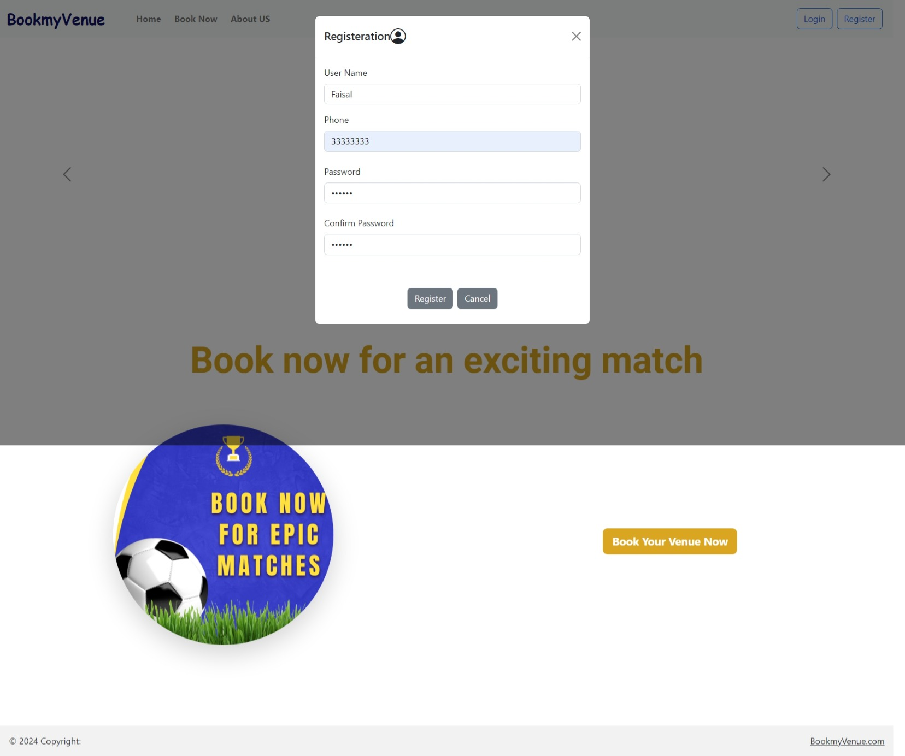

# BookmyVenue

## About The Project
The web application provides a streamlined approach for reserving football venues across key cities in Bahrain.The user-friendly interface allows for swift selection and booking of desired venues. Comprehensive details regarding facilities, costs, and specific locations aid users in making well-informed choices. This platform is designed to facilitate an efficient reservation experience, catering to the needs of sports fans and event planners alike. Ensure a smooth and straightforward stadium reservation for your upcoming sports event.

## Technologies used
* ### Bootstrap
* ### Html/ CSS
* ### PHP
* ### Javascript
* ### MySQL

## Demos, Screenshots and Example Output (LocalHost XAMPP)
* ### Homepage

* ### Register

* ### Login

* ### View available cities

* ### Book Ground

* ### Successfully Booked

* ### Booking can be cancelled

* ### Admin can add new venues 

* ### New venue Added

## Hosting

Used XAMPP for local hosting.
## Version
* V1.0 
    initial release.